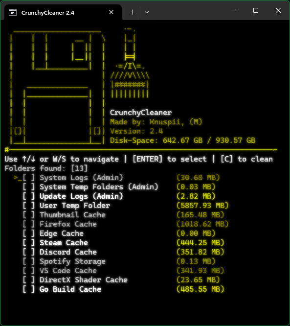

<h1>CrunchyCleaner 💾🧹</h1>

### ✨ A lightweight, software [cache](https://wikipedia.org/wiki/Cache) cleanup tool for Windows & Linux.
- 💻 **Cross-Platform**: Works on both **Windows** and **Linux**
- ⚡ **Lightweight**: Single binary, no dependencies (just download and run it)
- 📲 **TUI (Text-UI)**: Simple, minimalist interface, no confusing menus

## 📥 [[Download here]](https://github.com/knuspii/crunchycleaner/releases) <- Click here to download CrunchyCleaner!

## Supported Software List:
- Firefox
- Google Chrome
- Microsoft Edge
- Steam
- Discord
- Spotify
- Visual Studio Code
- Pip Cache
- Go Build Cache

> [!WARNING]
> You use this tool at your own risk!

## External Dependencies
This project uses the following external dependencies:
- **[github.com/eiannone/keyboard](https://github.com/eiannone/keyboard)** – used for cross-platform keyboard input (MIT License)
