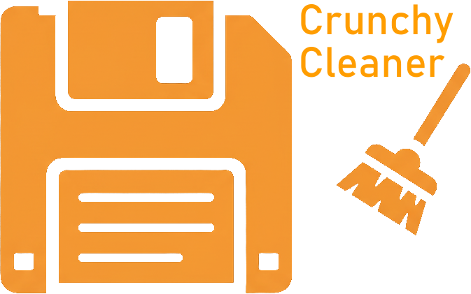
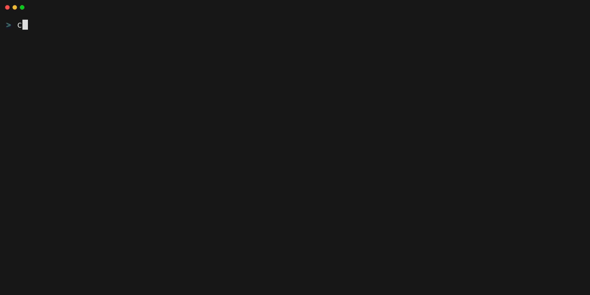

<p align="center">
  
  <a href="https://goreportcard.com/report/github.com/knuspii/crunchycleaner"></a>
  <a href="https://github.com/knuspii/crunchycleaner/actions/workflows/go.yml"></a>
  <a href="https://github.com/knuspii/crunchycleaner/stargazers"></a>
  <br>
  
</p>

<div align="center">
<h1>CrunchyCleaner </h1>

</div>

### 🧹 A lightweight, software [cache](https://wikipedia.org/wiki/Cache_(computing)) cleanup tool for Windows & Linux.
- **Cross-Platform:** Works on both **Windows** and **Linux**
- **Lightweight:** Single binary, no dependencies (just download and run it)
- **TUI (Text-UI):** Simple, minimalist interface, no confusing menus

---

## 📥 [[Download here]](https://github.com/knuspii/crunchycleaner/releases) <- Click here to download CrunchyCleaner!
[](https://github.com/knuspii/crunchycleaner/releases)

Or
```
go install github.com/Knuspii/CrunchyCleaner@latest
```

## 🎖️ Featured on
[](https://github.com/rothgar/awesome-tuis)
[](https://github.com/avelino/awesome-go)
[](https://github.com/0PandaDEV/awesome-windows)

---

## Supported Software List:
| Category | Software / Path |
| :--- | :--- |
| **System** | System Logs, System Temp Folders, Thumbnail Cache, DirectX Shader Cache |
| **Browsers** | Firefox, Google Chrome, Microsoft Edge, Brave, Opera |
| **Development** | Visual Studio Code, Go Cache, Pip Cache, NPM Cache, Yarn Cache, Cargo Cache |
| **Server** | coming soon* |
| **Gaming** | Steam, Epic Games(Heroic) |
| **Apps** | Discord, Spotify, Thunderbird |

**Flatpak is supported** \
**Snap is not supported**

## Options:
```
  -a    Automate cleaning (select all and start immediately)
  -d    Simulation mode without deleting files (for testing)
  -i    Skip terminal resizing and environment initialization
  -v    Display version information
```

> [!WARNING]
> You use this tool at your own risk!

> [!NOTE]
> AI was used for this project in some parts.

## Q&A
**Q:** Will this break my system? \
**A:** No.\
\
**Q:** What does it actually delete? \
**A:** Only cache files and temp files.\
\
**Q:** Why another cleaner? \
**A:** Because this one is easy, simple, small and lightweight.

## Other Downloads
CrunchyCleaner is also available on SourceForge \
[](https://sourceforge.net/projects/crunchycleaner/files/latest/download)
[](https://sourceforge.net/projects/crunchycleaner/files/latest/download)

## External Dependencies
This project uses the following external dependencies:
- **[github.com/eiannone/keyboard](https://github.com/eiannone/keyboard)** – used for cross-platform keyboard input (MIT License)
