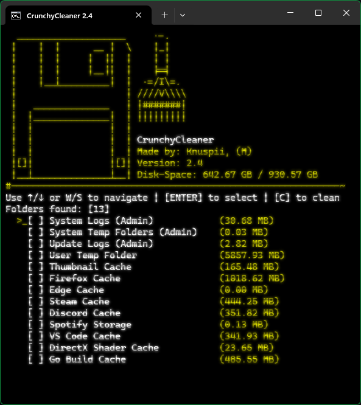

<p align="center">
  <a href="https://go.dev/"></a>
  <a href="https://github.com/knuspii/crunchycleaner"></a>
  <a href="https://goreportcard.com/report/github.com/knuspii/crunchycleaner"></a>
  <a href="https://github.com/knuspii/crunchycleaner/actions/workflows/go.yml"></a>
  <a href="https://github.com/knuspii/crunchycleaner/issues"></a>
  <a href="https://github.com/knuspii/crunchycleaner/stargazers"></a>
  <br>
  
  
</p>

<div align="center">
<h1>CrunchyCleaner 💾🧹</h1>

</div>

### ✨ A lightweight, software [cache](https://wikipedia.org/wiki/Cache_(computing)) cleanup tool for Windows & Linux.
- 💻 **Cross-Platform:** Works on both **Windows** and **Linux**
- ⚡ **Lightweight:** Single binary, no dependencies (just download and run it)
- 📲 **TUI (Text-UI):** Simple, minimalist interface, no confusing menus

## 📥 [[Download here]](https://github.com/knuspii/crunchycleaner/releases) <- Click here to download CrunchyCleaner!
[](https://github.com/Knuspii/crunchycleaner/releases)

## Supported Software List:
- System Logs
- System Temp Folders
- Thumbnail Cache
- Firefox
- Google Chrome
- Microsoft Edge
- Brave
- Opera
- Thunderbird
- Steam
- Epic Games
- Discord
- Spotify
- Visual Studio Code
- DirectX Shader Cache
- Go Build Cache
- Pip Cache
- NPM Cache
- Yarn Cache
- Cargo Cache

**Not working with software installed by snap**

> [!WARNING]
> You use this tool at your own risk!

## ⚙️ Start options:
```
Usage:
  crunchycleaner [option]

Options:
  -d    Simulation mode without deleting files (for testing)
  -i    Skip terminal resizing and environment initialization
  -v    Display version information
```

## Q&A
**Q:** Will this break my system?\
**A:** No.\
\
**Q:** What does it actually delete?\
**A:** Only cache files and temp files.\
\
**Q:** Why another cleaner?\
**A:** Because this one is easy, simple, small and lightweight.

## Other Downloads
CrunchyCleaner is also available on SourceForge \
[](https://sourceforge.net/projects/crunchycleaner/files/latest/download)
[](https://sourceforge.net/projects/crunchycleaner/files/latest/download)

## External Dependencies
This project uses the following external dependencies:
- **[github.com/eiannone/keyboard](https://github.com/eiannone/keyboard)** – used for cross-platform keyboard input (MIT License)
